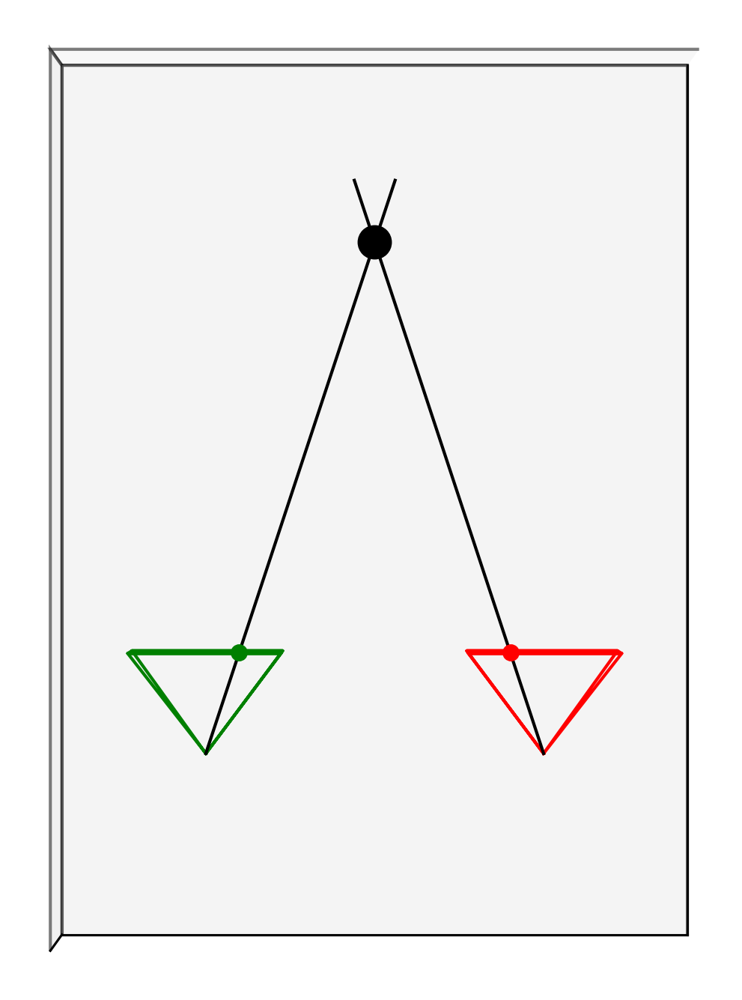
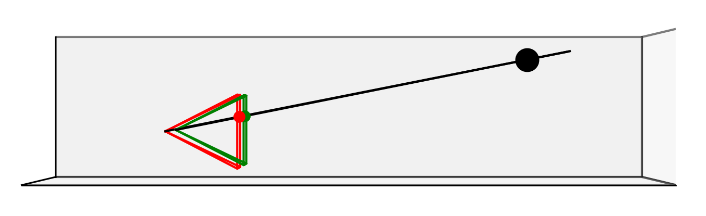
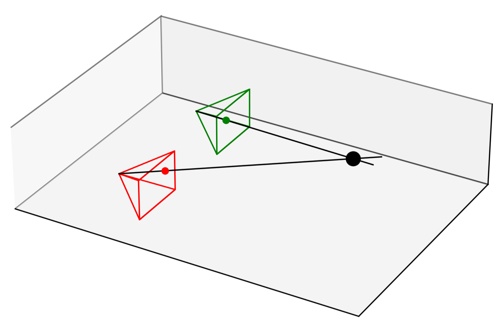
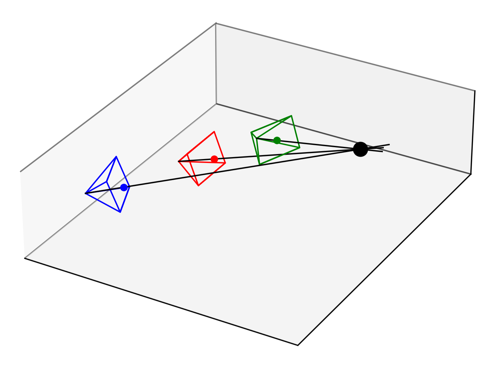
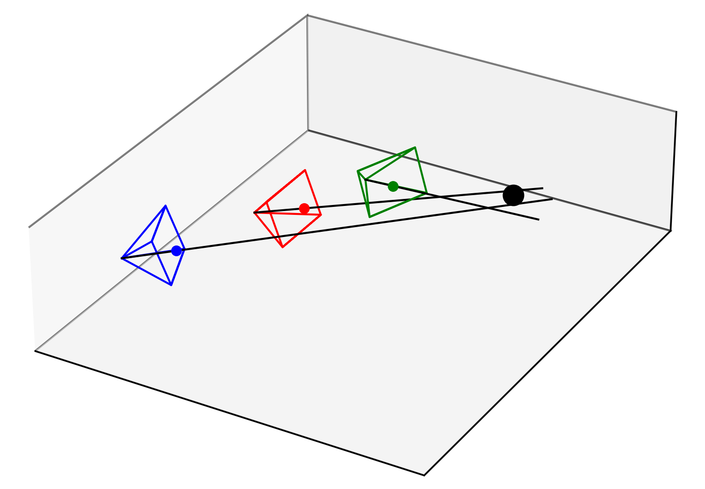
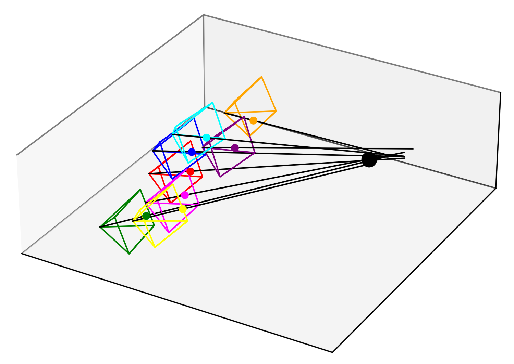

In the world of computer vision, discoveries often come not through grand designs but through simple, curious experiments. My journey toward understanding the concept of disparity began with a problem that seemed almost trivial at first — calculating the distance of a single LED from two parallel cameras.



It started as a straightforward task. I had two cameras, perfectly aligned and fixed at a known distance apart, and a bright, tiny LED glowing in front of them. I got their pixel position on screen by using basic OpenCV methods - simple, but it worked. The challenge was to determine how far that LED was from the cameras. With my background in robotics, I knew the basics of triangulation, so the problem seemed like it would be a simple exercise in geometry. But the devil, as they say, was in the details.
I finally stumbled upon this [expression](https://docs.opencv.org/4.x/dd/d53/tutorial_py_depthmap.html)
```math
z=\frac{b f}{\Delta p}
```
where $`\Delta p`$ is the difference of the x pixel values of the two images, $`f`$ is the focal length of the camera, and $`b`$ is the baseline, i.e., the known distance between the two cameras in meters.
This equation is simple, deceptively simple. When I first saw this equation it made sense intuitively. You can derive it by looking at two similar triangles, which I won't get into now, however.
But then I wondered myself: How come a problem in computer vision becomes so easy when everything else is usually more complicated than you expect? Moreover, this relationship hides a few things from us, namely, how robust this estimate is, what the assumptions are, and what we do when our cameras are not perfectly aligned. I want to answer some of these questions and gain a very deep understanding of what is really going on.
I will do this in a counter-intuitive way: I will make the problem harder for us by looking at a more general case first. Then I will see what needs to be done to get to the point where the resulting equations become as simple as in the equation above.

Let's start with the cameras. Of course, when we don't know where our cameras are, we won't be able to deduce the position of our object in space. So let's put some numbers to it! In general our camera $`i`$ has six degrees of freedom, a translation $`\mathbf{t}_i`$ (in the x, y, and z direction) in our base frame and a rotation which can be parametrized by three independent parameters, e.g., by using euler angles, a rotation vector, or quaternions. The exact representation won't matter in the following, as I will be using the corresponding rotation matrix $`\mathbf{R}_i`$ in the following.



The camera will only see the projection of our target $`\mathbf{t}_\text{T}`$ onto the screen. This camera model is called the pinhole model. The corresponding pixel coordinates are implied by the vector
```math
\mathbf{p}_i = \begin{bmatrix} {p}_{i,x} \\\ {p}_{i,y} \\\ 1 \end{bmatrix},
```
where $`{p}_{i,x}`$ and $`{p}_{i,y}`$ specify the x and y pixel position on our screen.
To get from pixels to coordinates, we use the camera intrinsic matrix $`\mathbf{F}_i`$, which usually takes the form
```math
\mathbf{F}_i=\begin{bmatrix} f_{x} & 0 & c_x \\\ 0 & {f}_{y} & c_y \\\ 0 & 0 & 1 \end{bmatrix},
```
where $`f_{x}`$ and $`f_{y}`$ are the focal lengths in the x and y direction and $`c_{x}`$ and $`c_{y}`$ denote the cameras center pixel coordinates (its principal point). These parameters are obtained from a calibration procedure and they differ from camera to camera and depend, among other things, on the lens used.

The relationship between a measurement (with components $`{x}_{i}`$, $`{y}_{i}`$, and $`{z}_{i}`$) in the camera frame and the corresponding pixel coordinates is
```math
z_i \mathbf{p}_i=\mathbf{F}_i\begin{bmatrix} {x}_{i}\\\ {y}_{i} \\\ {z}_{i} \end{bmatrix},
```
which tells us that infinitely many points on a given line are projected onto the same pixel positions.
This line is along the vector $`\mathbf{F}^{-1}_i \mathbf{p}_i`$ in the camera frame. While my linear algebra professor always told me not to invert matrices, this matrix is pretty small and has a pretty simple structure, so I think he'll let me get away with this this time ;)
This aforementioned line can then be transformed to the base frame using the camera's translation vector $`\mathbf{t}_i`$ and rotation matrix $`\mathbf{R}_i`$
```math
z_i \mathbf{R}_i\mathbf{F}^{-1}_i \mathbf{p}_i + \mathbf{t}_i
```
Since we have two cameras that see the same target, these two lines must intersect at the target $`\mathbf{t}_\text{T}`$, namely,
```math
z_1 \mathbf{R}_1 \mathbf{F}^{-1}_1 \mathbf{p}_1 + \mathbf{t}_1 = \mathbf{t}_\text{T} = z_2 \mathbf{R}_2 \mathbf{F}^{-1}_2 \mathbf{p}_2 + \mathbf{t}_2.
```
If we can compute either $`z_1`$ or $`z_2`$, we know how far to move along one of the two lines to get to our unknown target!
But before we solve this equation, I want to shift down a gear and get back to where we started..
Looking at our deceptively simple relationship, we can note a few things:
1) The cameras are not rotated with respect to each other.
2) The cameras are only shifted along one axis, let's say the x axis, by the known baseline $b$.
3) For both cameras, the same focal length $f$ and x center pixel coordinates are used.

This simplifies things!
For the rotation matrices in statement 1), we might as well take $`\mathbf{R}_1 = \mathbf{R}_2 = \mathbf{I}`$.
From 2) we know that $`\mathbf{t}_2 = \mathbf{t}_1 + \begin{bmatrix} b & 0 & 0 \end{bmatrix}^\text{T}`$. When we assume that the first camera is in the origin of the base frame we get $`\mathbf{t}_1=\mathbf{0}`$. As the cameras are oriented perfectly parallel to each other, the z distance to the target must also be the same $`z_1=z_2=z`$.
From 3), one might conclude that the intrinsic camera matrix for both cameras is identical $`\mathbf{F}_1=\mathbf{F}_2=\mathbf{F}`$.
Phew, okay.. that's a lot, let's start substituting these terms
```math
z \mathbf{I} \mathbf{F}^{-1} \begin{bmatrix} {p}_{1,x}\\\ {p}_{1,y} \\\ 1 \end{bmatrix}  + \mathbf{0} = \mathbf{t}_\text{T} = z \mathbf{I} \mathbf{F}^{-1} \begin{bmatrix} {p}_{2,x}\\\ {p}_{2,y} \\\ 1 \end{bmatrix} + \mathbf{0} + \begin{bmatrix} b \\\ 0 \\\ 0 \end{bmatrix}.
```
My linear algebra professor is still haunting me in my dreams, so let's get rid of this pesky inverse..
```math
z\begin{bmatrix} {p}_{1,x}\\\ {p}_{1,y} \\\ 1 \end{bmatrix} = z \begin{bmatrix} {p}_{2,x}\\\ {p}_{2,y} \\\ 1 \end{bmatrix} + \mathbf{F}\begin{bmatrix} b \\\ 0 \\\ 0 \end{bmatrix}.
```
Okay, things are starting to look simpler, let's do some more rearranging, assuming $`z>0`$, and using what we know about $`\mathbf{F}`$
```math
\begin{bmatrix} {p}_{1,x} - {p}_{2,x} \\\ {p}_{1,y} - {p}_{2,y} \\\ 0 \end{bmatrix} = + \begin{bmatrix} \frac{b f}{z} \\\ 0 \\\ 0 \end{bmatrix}.
```
From the third row, we can conclude that $0=0$, a groundbreaking insight..
From the second row we conclude that $`{p}_{1,y} = {p}_{2,y}`$. Makes sense, the cameras are perfectly parallel and use the same intrinsic camera matrix, so when the target moves up or down by some number of pixels on one screen, the same must happen on the other screen. And oh hey! From the first row, we get
$`{p}_{1,x} - {p}_{2,x} = \frac{b f}{z}`$. Looks familiar, huh? With the difference of the x pixel coordinates $`{p}_{1,x} - {p}_{2,x} =: \Delta p`$ things can be arranged to
```math
z = \frac{b f}{\Delta p}!
```
Great! We went through all of this to get to the result we started with! However, we (hopefully) gained some new insights along the way. Namely, our simple relationship holds if the assumptions me made are true.
Here's the twist: Are your cameras REALLY perfectly aligned? Can we really assume that both intrinsic camera matrices are the same? Well, that probably depends on the accuracy we are after and how rigidly the cameras are mounted. If we use the same model of camera for both pictures, the focal lengths should be pretty close, I suppose.. But now that we did all of this we don't have this restriction anymore. We can use different cameras, and we can place the cameras almost anywhere! But beware, depending on how you detect the target on screen and how the target is shaped, might violate the assumption that we are seeing the exact same point on both screens. So don't get too crazy placing your cameras, okay?

But wait! We haven't yet solved the vector equation for general translations, rotations, and intrinsics.
While some straightforward vector matrix multiplications will get us there, let's do what we have been doing the entire time and overcomplicate things a bit. We have 5 unknowns, $`z_1`$, $`z_2`$, and $`\mathbf{t}_\text{T}`$. To tidy things up, let's simplify the things we do know: $`\mathbf{a}_i := \mathbf{R}_i \mathbf{F}^{-1}_i \mathbf{p}_i`$.
Our equation becomes $` z_1 \mathbf{a}_1 + \mathbf{t}_1 = z_2 \mathbf{a}_2 + \mathbf{t}_2`$. Okay, I said we wouldn't do it, but for the sake of completeness, here's the term after rearranging,g which I said we wanted to avoid:
```math
\begin{bmatrix} \mathbf{a}_{1} & -\mathbf{a}_{2} \end{bmatrix} \begin{bmatrix} {z}_{1}\\\ {z}_{2}\end{bmatrix} = (\mathbf{t}_2-\mathbf{t}_1) =: \mathbf{A}\mathbf{z}
```
Unfortunately, $`\mathbf{A}`$ is a $`3 \times 2`$ matrix, so even if I weren't scared of my linear algebra professor, we would have no luck left multiplying with an inverse. But the system of equations is overdetermined, so let's just use the pseudo-inverse (or [Moore–Penrose inverse](https://en.wikipedia.org/wiki/Moore%E2%80%93Penrose_inverse)). For our case for real matricies it is defined as $`\mathbf{A}^{\dagger}:=(\mathbf{A}^\text{T}\mathbf{A})^{-1}\mathbf{A}^\text{T}`$ and is a left inverse of $`\mathbf{A}`$.
We therefore obtain or solution as $`\mathbf{z}=\mathbf{A}^{\dagger}(\mathbf{t}_2-\mathbf{t}_1)`$.

However, I promised some over-complications, and after all, the pseudo-inverse smells like [ordinary least squares](https://en.wikipedia.org/wiki/Linear_least_squares) to me! So let's instead write the expression like so
```math
\begin{bmatrix} \mathbf{a}_{1} & \mathbf{0} & -\mathbf{I} \\\ \mathbf{0} & \mathbf{a}_{2} & -\mathbf{I} \end{bmatrix} \begin{bmatrix} \mathbf{z} \\\ \mathbf{t}_\text{T} \end{bmatrix} = -\begin{bmatrix} \mathbf{t}_1 \\\ \mathbf{t}_2 \end{bmatrix}=:\tilde{\mathbf{A}}\tilde{\mathbf{z}}=\tilde{\mathbf{b}}.
```
Now that's a behemoth of a matrix right there! It can be shown that the two expressions are actually equivalent, i.e., they give the same result. I'll spare you with the proof, as is doesn't help us with the problem, but I might do it in my following blog-post-style contribution on GitHub! But the nice thing is that we isolated our five unknowns into a single vector $\tilde{\mathbf{z}}$. We can, again, use the pseudo inverse to get our solution $`\tilde{\mathbf{z}}=\tilde{\mathbf{A}}^{\dagger}\tilde{\mathbf{b}}`$. The great thing now is that since we basically minimizing the squared distances (we're secretly doing linear least squares under the hood) of our rays $`\mathbf{a}_i`$ to our target $`\mathbf{t}_\text{T}`$, the solution is very robust. Even if our detected pixel coordinates are not sub-pixel accurate or off by a bit, and our rays don't intersect at all, the solution still gives the best guess (if we use the sum of squared errors as a metric) of where the real target is. Moreover, due to the "simple" structure of the equation, we can extend the findings to more than two cameras! Let's do it for $n$ cameras
```math
\text{blkdiag}(\mathbf{a}_1,\dots,\mathbf{a}_n)~\tilde{\mathbf{z}}=\tilde{\mathbf{b}}:=\begin{bmatrix} \mathbf{a}_{1} & & \mathbf{0} & -\mathbf{I} \\\  & \ddots & & \vdots \\\ \mathbf{0} & & \mathbf{a}_{n} & -\mathbf{I}\end{bmatrix} \begin{bmatrix} {z}_{1} \\\ \vdots \\\ {z}_{n} \\\ \mathbf{t}_\text{T} \end{bmatrix} = -\begin{bmatrix} \mathbf{t}_1 \\\ \vdots \\\ \mathbf{t}_n \end{bmatrix}
```


Now we can do disparity with an arbitrary number of cameras which by redundancy compensate for measurement noise! I told you all the over-complications would pay off!



Looking at the first relationship and where we started, we came quite a long way, didn't we? Anyways, I hope you could follow along and can put this framework to some good use in your next computer vision project. Since math is nice and all, but nothing really beats hands-on experience I included a Jupiter notebook where we will look at a numerical example of the equations shown here, which will give a better visual understanding of what we are doing :)
Feel free to play around with it, try multiple cameras, positions, intrinsics, different levels of measurement noise, ...

Cheers,<br />
Hannes

[LinkedIn](https://www.linkedin.com/in/hannes-eschmann-247521284/)<br />
[GitHub](https://github.com/heschmann)


